# ESP_SR-HeyKiraHiLily

The ESP_SR-HeyKiraHiLily is an offline Speech Recognition ESP_SR example for the Arduino IDE and an ESP32-S3 with a [way](#who-to-make-a-custom-srmodelsbin) to change the Wake Words.

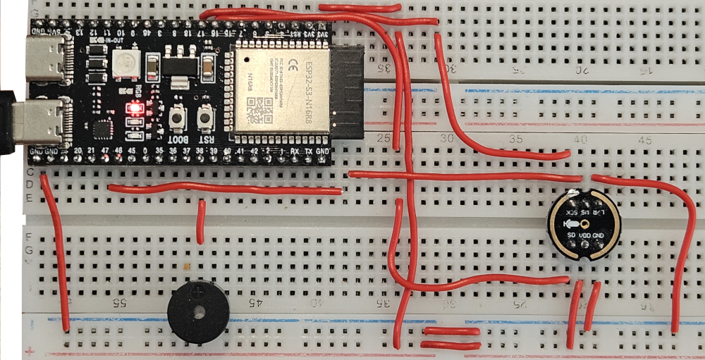

> [!NOTE]
> arduino-esp32 for the Arduino IDE provides a builtin speech recognition example "ESP_SR\Basic.ino". ESP_SR-HeyKiraHiLily based on this Arduino sketch, but Basic.ino uses a preconfigured srmodels.bin file with one fixed Wake Word "Hi ESP". ESP_SR-HeyKiraHiLily shows you a way to create a custom srmodels.bin and select Wake Words.

ESP_SR-HeyKiraHiLily uses two Wake Words "Hey Kira" and "Hi Lily". You could also use other [Wake Works provided by Espressif](#espressif-wake-words-from-esp-skainet-masterzip-downloaded-14092026).

To do this the ESP_SR-HeyKiraHiLily needs a custom **srmodels.bin** file. 
> [!IMPORTANT] 
> You have to [create this srmodels.bin by yourself](#who-to-make-a-custom-srmodelsbin).

The ESP_SR-HeyKiraHiLily has a passive buzzer to give some feedback to the user:

| Buzzer  | When... |
| ------------- | ------------- |
| Short beep  | A Wake Word was detected => Wait for a command |
| Long beep | No command was detected 6 seconds after the Wake Word => Wait again for a Wake Word |

## Wake Words

- Hey Kira
- Hi Lily

## Commands
- Turn on the light
- Turn off the light
- Fire
- Switch on the light
- Lights on
- Switch off the light
- Light off
- Go dark
- Turn on the sound

## License and copyright
This example is licensed under the terms of CC0 [Copyright (c) 2026 codingABI](LICENSE). 

## Appendix

### Hardware
- ESP32-S3 N16R8 DevKitC (Board manager: ESP32S3 Dev Module, PSRAM: OPI PSRAM, Flash Size: 16 MB (128Mb), Partition: ESP SR 16M) 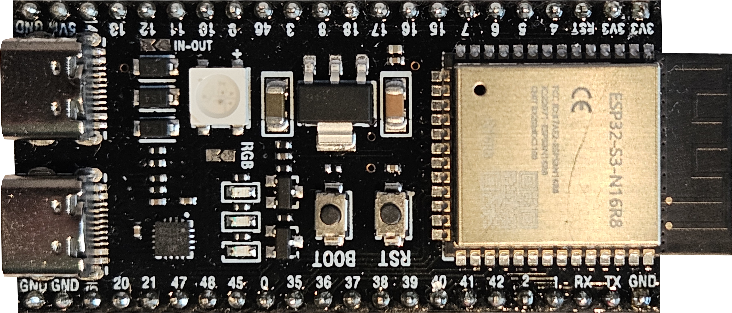
- I2S microphone INMP441 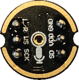
- Passive buzzer

> [!WARNING]
> A standard ESP32-WROOM has too less flash memory for the ESP_SR-HeyKiraHiLily

### Used Arduino development environment
- Arduino IDE 1.8.19 or 2.3.10
- arduino-esp32 3.3.11

### Code
The sketch was written with the Arduino IDE and can be found in [here](ESP_SR-HeyKiraHiLily/ESP_SR-HeyKiraHiLily.ino)

### Schematic

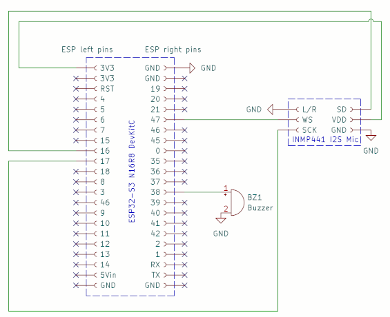

### Power consumption

| Operation  | mW |
| ------------- | ------------- |
| Waiting for a Wake Word  | 275  |
| Waiting for a command | 370  |

### Who to make a custom srmodels.bin?

Download and install **esp-idf-tools-setup-offline.5.5.5.exe** from https://github.com/espressif/idf-installer/releases

> [!NOTE]
> I used arduino-esp32 3.3.11 which is based on idf 5.5.5 and I guess matching versions should work.

Download **esp-skainet-master.zip** (I used current content from 14.09.2026) via **Download ZIP** from https://github.com/espressif/esp-skainet

Extract **esp-skainet-master.zip** to a local folder, for example _c:\\_

open **ESP-IDF 5.5 Powershell**
```
cd c:\esp-skainet-master\examples\en_speech_commands_recognition\
idf.py set-target esp32s3
idf.py menuconfig
```
Open **ESP Speech Recognition**
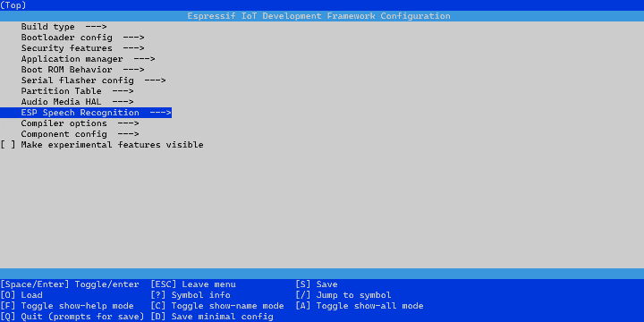

Open **Load Multiple Wake Words (WakeNet9 or WakeNet10)**
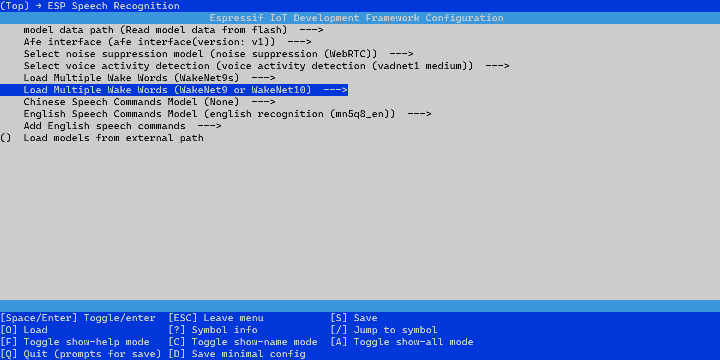

Disable default Wake Word **Hi,ESP(wn9_hiesp)**
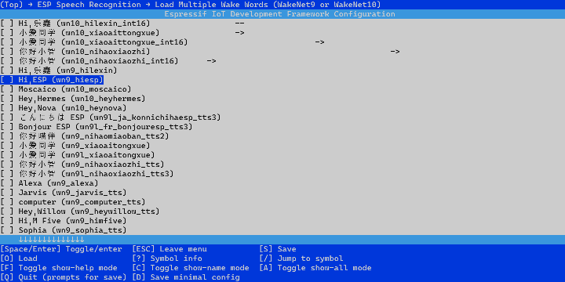

Enable Wake Words **Hi,Kira (wn9_heykira_tts3)** and **Hi,Lily (wn9_hilili_tts)**
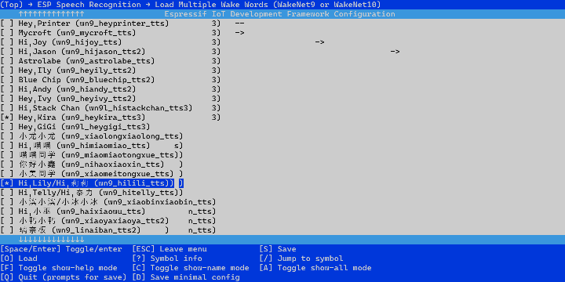

ESC to go back to top menu and open **English Speech Commands Model**
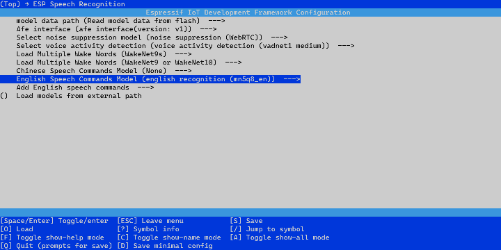

Select **general english recognition (mn7_en)**
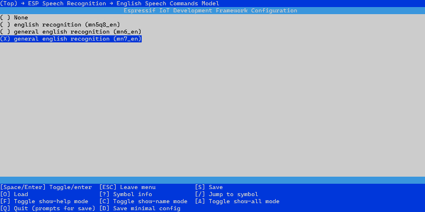

Press **S** to Save and **Q** for Quit

Open _C:\esp-skainet-master\examples\en_speech_commands_recognition\partitions.csv_ with notepad and change the Size 2048k to **3048k**

```
# Espressif ESP32 Partition Table
# Name,  Type, SubType, Offset,  Size
factory, app,  factory, 0x010000, 3048k
model,  data, spiffs,         , 5168K,
```

> [!TIP]
> Otherwise you could get compile error 
> 
> ```
> [1460/1460] C:\WINDOWS\system32\cmd.exe /C "cd /D C:\esp-s...ommands_recognition/build/speech_commands_recognition.bin"
> FAILED: esp-idf/esptool_py/CMakeFiles/app_check_size C:/esp-skainet-master/examples/en_speech_commands_recognition/build/esp-idf/esptool_py/CMakeFiles/app_check_size
> ```


Compile
```
idf.py build
```

> [!TIP]
> If you get compile error
> ```
> Traceback (most recent call last):
>   File "C:\esp-skainet-master\examples\en_speech_commands_recognition\managed_components\espressif__esp-sr\model\movemodel.py", line 240, in <module>
>     print('\u2500' * 40)
>   File "encodings\cp1252.py", line 19, in encode
> UnicodeEncodeError: 'charmap' codec can't encode characters > in position 0-39: character maps to <undefined>
> ```
> you have to enable **Use Unicode UTF-8 for worldwide language support** in Microsoft Windows 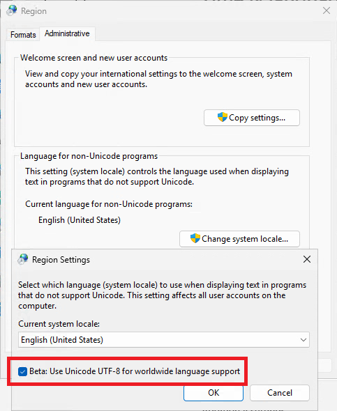 [IDF requirements](https://docs.espressif.com/projects/esp-idf/en/v5.5.5/esp32s3/get-started/windows-setup.html)
> 

After compiling without errors the new **srmodels.bin** can be found under _C:\esp-skainet-master\examples\en_speech_commands_recognition\build\srmodels_

Make a backup of the original **srmodels.bin** under 
_C:\Users\\%username\%\AppData\Local\Arduino15\packages\esp32\tools\esp32s3-libs\3.3.11\esp_sr_ (or _portable\packages\esp32\tools\esp32s3-libs\3.3.11\esp_sr_  if you use Arduino IDE 1.x in portable mode)  and replace the existing file with your new **srmodels.bin**

Now you can compile the [Arduino-Sketch](/ESP_SR-HeyKiraHiLili/ESP_SR-HeyKiraHiLili.ino) with your Arduino IDE and after flashing to the esp32 the serial output on the esp32 should show

```
MC Quantized vadnet1:vadnet1_mediumv1_Speech_1_0.5_0.1, min speech:128 ms, min noise:992 ms, mode:0, threshold:0.500, channel:1, tigger:v1 (May 25 2026 15:51:02) 
MC Quantized wakenet9: wakenet9_tts3h12_Hey Kira_3_0.613_0.624, tigger:v4, mode:0, p:0, (May 25 2026 15:51:00)
MC Quantized wakenet9: wakenet9l_tts1h8_Hi,Lily or Hi,莉莉_3_0.633_0.639, tigger:v4, mode:0, p:0, (May 25 2026 15:51:00)
Build fst from commands.
Quantized MultiNet7:rnnt_ctc_2.0, name:mn7_en, (May 25 2026 15:51:00)
Quantized MultiNet7 search method: 2, time out:5.8 s
Build fst from commands.
```

### Espressif Wake Words (from esp-skainet-master.zip downloaded 14.09.2026)

- Hi,乐鑫 (wn9s_hilexin)
- Hi,ESP (wn9s_hiesp)
- 你好小智 (wn9s_nihaoxiaozhi)
- Hi,Jason (wn9s_hijason)
- Hi,乐鑫 (wn10_hilexin_int16) 
- 小爱同学 (wn10_xiaoaittongxue)
- 小爱同学 (wn10_xiaoaittongxue_int16)
- 你好小智 (wn10_nihaoxiaozhi)
- 你好小智 (wn10_nihaoxiaozvhi_int16)
- Hi,乐鑫 (wn9_hilexin)
- Hi,ESP (wn9_hiesp)
- Moscaico (wn10_moscaico)
- こんにちは ESP (wn9l_ja_konnichihaesp_tts3)
- Bonjour ESP (wn9l_fr_bonjouresp_tts3)
- 你好喵伴 (wn9_nihaomiaoban_tts2)
- 小爱同学 (wn9_xiaoaitongxue)
- 小爱同学 (wn9l_xiaoaitongxue)
- 你好小智 (wn9_nihaoxiaozhi_tts)
- 你好小智 (wn9l_nihaoxiaozhi_tts3)
- Alexa (wn9_alexa)
- Jarvis (wn9_jarvis_tts)
- computer (wn9_computer_tts)
- Hey,Willow (wn9_heywillow_tts)
- Hi,M Five (wn9_himfive)
- Sophia (wn9_sophia_tts)
- Hey,Wanda (wn9_heywanda_tts)
- Hi,Jolly (wn9_hijolly_tts2) 
- Hi,Fairy (wn9_hifairy_tts2)
- Hey,Printer (wn9_heyprinter_tts)
- Mycroft (wn9_mycroft_tts)
- Hi,Joy (wn9_hijoy_tts)
- Hi,Jason (wn9_hijason_tts2)
- Astrolabe (wn9_astrolabe_tts)
- Hey,Ily (wn9_heyily_tts2)
- Blue Chip (wn9_bluechip_tts2)
- Hi,Andy (wn9_hiandy_tts2)
- Hey,Ivy (wn9_heyivy_tts2)
- Hi,Stack Chan (wn9l_histackchan_tts3)
- Hey,Kira (wn9_heykira_tts3)
- Hey,GiGi (wn9l_heygigi_tts3)
- 小龙小龙 (wn9_xiaolongxiaolong_tts)
- Hi,喵喵 (wn9_himiaomiao_tts)
- 喵喵同学 (wn9_miaomiaotongxue_tts)
- 你好小鑫 (wn9_nihaoxiaoxin_tts)
- 小美同学 (wn9_xiaomeitongxue_tts)
- Hi,Lily/Hi,莉莉 (wn9_hilili_tts)
- Hi,Telly/Hi,泰力 (wn9_hitelly_tts)
- 小滨小滨/小冰小冰 (wn9_xiaobinxiaobin_tts)        
- Hi,小巫 (wn9_haixiaowu_tts)
- 小鸭小鸭 (wn9_xiaoyaxiaoya_tts2)    
- 璃奈板 (wn9_linaiban_tts2)
- 小酥肉 (wn9_xiaosurou_tts2)
- 宇同学 (wn9_xiaoyutongxue_tts2)
- 明同学 (wn9_ximingtongxue_tts2)
- 康同学 (wn9_xikangtongxue_tts2)
- 箭小箭 (wn9_xikajianxiaojian_tts2)
- 特小特 (wn9_xikatexiaote_tts2)
- 你好小益(wn9_xnihaoxiaoyi_tts2)
- 你百应益(wn9_xnihbaiying_tts2))
- 你东东益(wn9_xnihdongdong_tts2)
- Hi Wall E or Hi 瓦力(wn9_hiwalle_tts2)
- 小鹿小鹿 (wn9_xiaoluxiaolu_tts2)
- 你好小安 (wn9_nihaoxiaoan_tts2)
- 你 脉 安 (wn93hao3xiao3mai4_tts2)
- 你好小瑞 (wn9_ni3hao3xiao3rui4_tts3)
- 嗨小欧 (wn9_hai1xiao3ou1_tts3)
- 小珈小珈 (wn9_xiao3jia1xiao3jia1_tts3)
- 峰小峰  (wn9_xiaofeng1xiao3feng1_tts3)
- 嗨小象 (wn9_hai1xiao3xiang4_tts3)
- 你好星宝 (wn9l_ni3ho3xiang1bao3_tts3)